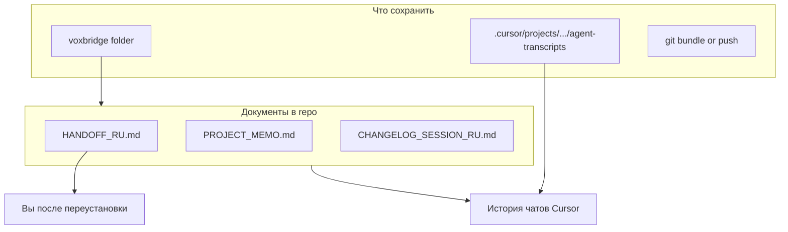

# CURSOR_BACKUP — как сохранить прогресс агентов

История чатов и контекст Cursor **не хранятся в папке `voxbridge`**.  
Их нужно копировать отдельно, если хотите продолжить те же диалоги после переустановки Windows.

---

## Где лежат данные Cursor (Windows)

Основной путь проекта VoxBridge:

```
C:\Users\_r3drum\.cursor\projects\c-Users-r3drum-Desktop-all-voxbridge\
```

Внутри обычно есть:

| Папка / файл | Назначение |
|--------------|------------|
| `agent-transcripts\` | Транскрипты чатов и subagent-ов (`.jsonl`) |
| другие метаданные сессии | Привязка к workspace |

Пример транскрипта (имя меняется):

```
agent-transcripts\45b1180e-3adc-4746-97a6-67143881c2fd\45b1180e-3adc-4746-97a6-67143881c2fd.jsonl
```

Также может существовать параллельная сессия:

```
C:\Users\_r3drum\.cursor\projects\c-Users-r3drum-Desktop-all-voxbridge\agent-transcripts\6331fa94-07e7-4a6f-b6cb-0a781664dcc9\
```

**Рекомендация:** скопировать всю папку  
`c-Users-r3drum-Desktop-all-voxbridge` целиком.

---

## Что скопировать на флешку / в облако

### Обязательно (два места)

1. **Проект**
   ```
   C:\Users\_r3drum\Desktop\all\Новая папка\voxbridge\
   ```
   Включая новые файлы: `HANDOFF_RU.md`, `PROJECT_MEMO.md`, и т.д.

2. **Cursor project data**
   ```
   C:\Users\_r3drum\.cursor\projects\c-Users-r3drum-Desktop-all-voxbridge\
   ```

### Желательно

- Весь каталог `C:\Users\_r3drum\.cursor\projects\` — если путь к проекту на диске изменится, проще найти старые transcripts.
- Правила Cursor (если настраивали): Settings → Rules / Memories — экспорт или скриншот.
- Файл `AGENTS.md` и `.cursor/rules` в репозитории (если появится) — уже в `voxbridge`.

### Git (надёжнее transcripts)

Если есть remote:

```bash
cd voxbridge
git push --all origin
```

Если remote нет — bundle:

```bash
cd voxbridge
git bundle create D:\backup\voxbridge-all.bundle --all
```

---

## Что НЕ обязательно копировать

| Путь | Почему |
|------|--------|
| `voxbridge/node_modules/` | `npm install` |
| `voxbridge/.next/` | пересоберётся при `npm run dev` |
| `voice-matching-service/.venv/` | создать venv заново |
| Кэши npm/pip на системном диске | переустановятся |

### Желательно копировать (большой размер)

| Путь | Почему |
|------|--------|
| `voice-matching-service/pretrained_models/` | Модель ECAPA — долгая загрузка с Hugging Face |

---

## После переустановки Windows

### Вариант A — восстановить Cursor как было

1. Установить Cursor.
2. Положить папку проекта на **тот же путь** (или близкий):
   `Desktop\all\Новая папка\voxbridge`
3. Скопировать обратно:
   `C:\Users\_r3drum\.cursor\projects\c-Users-r3drum-Desktop-all-voxbridge\`
4. Открыть папку в Cursor.

История чатов может подтянуться, если ID проекта совпадёт.

### Вариант B — только код (проще)

1. Скопировать только `voxbridge`.
2. Открыть в Cursor как новый проект.
3. В первом сообщении агенту приложить:
   - [`HANDOFF_RU.md`](HANDOFF_RU.md)
   - [`PROJECT_MEMO.md`](PROJECT_MEMO.md)
   - при необходимости [`CHANGELOG_SESSION_RU.md`](CHANGELOG_SESSION_RU.md)

Контекст восстановится из документов, без старых `.jsonl`.

---

## Проверка после восстановления

- [ ] `npm install` && `npm run dev` — сайт открывается.
- [ ] В Cursor видны старые чаты (если копировали `.cursor\projects\...`).
- [ ] `git log` показывает нужные ветки (`home-rebuild-v2`, …).
- [ ] Admin Lab + API: `uvicorn` на 8000, `/admin/ai-voice-matching`.

---

## Связь с документами в репозитории



---

*Сохраните этот файл вместе с проектом.*
