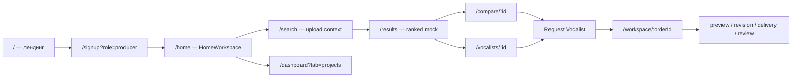
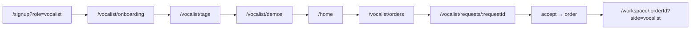

# PROJECT_MEMO — VoxBridge

Записка для AI-агентов. Обновляйте при существенных изменениях архитектуры или маршрутов.

**Документы для людей (handoff / переустановка ОС):**  
[`HANDOFF_RU.md`](HANDOFF_RU.md) · [`ROADMAP_RU.md`](ROADMAP_RU.md) · [`CHANGELOG_SESSION_RU.md`](CHANGELOG_SESSION_RU.md) · [`CURSOR_BACKUP_RU.md`](CURSOR_BACKUP_RU.md)

---

## Суть проекта VoxBridge

**VoxBridge** — MVP маркетплейса для **продюсеров** и **вокалистов** в музыкальной индустрии.

Идея:
- Продюсер загружает AI-вокал (или описывает желаемый голос) → получает ранжированный список вокалистов (сейчас **mock + теги**).
- Продюсер запрашивает вокалиста → создаётся **заказ** (`ProducerOrder`) → совместная **workspace**-комната с превью, ревизиями и финальной сдачей.
- Вокалист ведёт профиль, демо, теги; принимает **входящие запросы** (`VocalistRequest`) и работает в workspace.

Реальный AI-matching и бэкенд **ещё не подключены**. Всё состояние — **localStorage** + статические `mockVocalists`. **Supabase не добавлять**, пока пользователь явно не попросит.

Дизайн: тёмная тема, modern music / AI SaaS, не «корпоративный маркетплейс».

---

## Tech stack и правила

| Слой | Технология |
|------|------------|
| Framework | Next.js 16 App Router |
| UI | React 19, TypeScript, Tailwind CSS 4 |
| Данные (MVP) | `localStorage`, mock-данные в `lib/` |
| Auth (MVP) | Fake auth в `lib/auth.ts` |

**Правила разработки** (см. также `AGENTS.md`):
- Мелкие, безопасные изменения; не переписывать проект целиком без нужды.
- Редактировать файлы напрямую, не давать пользователю «вставь этот код».
- Тёмный современный UI, responsive.
- После правок кратко перечислить изменённые файлы.
- **Не подключать Supabase**, Stripe и т.п. без явного запроса.
- Коммиты — только по запросу пользователя.

**Подписка на client-store (важно):**
- В проекте **нет** `useSyncExternalStore`.
- Паттерн: модули `lib/*` с `subscribe*`, `get*`, кэшем snapshot + `listeners`/`emit`.
- Хуки: `useEffect` + `queueMicrotask(sync)` + `subscribe` → `useState` (`lib/hooks/use-producer-orders.ts`, `use-vocalist-requests.ts`, `use-upload-context.ts`).
- Утилиты: `useStoreRevision`, `useStoreSnapshot` в `lib/hooks/use-store-subscription.ts`.
- `useLocalStorage(key)` — сырое значение ключа, читается один раз в effect (`lib/hooks/use-local-storage.ts`).

---

## Producer flow и Vocalist flow (схемы путей)

### Producer (основной happy path)



Текстом:
1. `/` → Sign up / Login → `/home` (требует auth).
2. Поиск: `/search` (или `?mode=describe`) → `saveUploadContext` → `/results`.
3. Карточки → `/compare/[vocalistId]` или `/vocalists/[id]`.
4. **Request Vocalist** (`RequestVocalistButton`) → `createProducerOrder` → `/workspace/[orderId]`.
5. Dashboard: `/dashboard?tab=projects` (`ProducerProjectsSection`).

### Vocalist (основной happy path)



Текстом:
1. Signup vocalist → `/vocalist/onboarding` → опционально `/vocalist/tags`, `/vocalist/demos`.
2. `/home` — тот же feed, плюс баннер incoming requests.
3. `/vocalist/orders` — pending / accepted / declined (`ensureVocalistRequestsSeeded` создаёт mock).
4. Accept request → `acceptVocalistRequest` → order → `vocalistWorkspaceUrl(orderId)` = `/workspace/{id}?side=vocalist`.
5. Sidebar: Orders, Workspace (если есть активный заказ), My Profile (`/vocalists/{id}`), My Demos.

**Общая workspace:** `/workspace/[orderId]` — producer UI по умолчанию; vocalist UI при `?side=vocalist` или `role=vocalist` (legacy query) или если залогинен vocalist.

---

## Карта страниц

### Публичные (без `InternalPageShell` / без обязательного auth)

| Маршрут | Назначение |
|---------|------------|
| `/` | Лендинг, CTA на search / signup |
| `/login` | Fake login → `/home` |
| `/signup` | Регистрация; `?role=producer\|vocalist` |
| `/become-vocalist` | Публичная форма (local-only submit) |

### Внутренние (auth через `getStoredUser`, чаще `InternalPageShell` / `InternalShell`)

| Маршрут | Роль | Примечание |
|---------|------|------------|
| `/home` | обе | `InternalShell` + `HomeFeed` → `HomeWorkspace` (см. **режимы Home** ниже) |
| `/workspace` | обе | Список проектов |
| `/saved-vocalists` | producer | Сохранённые вокалисты |
| `/search` | producer* | `InternalPageShell`, сохраняет upload context |
| `/results` | producer* | Требует upload context, иначе redirect `/search` |
| `/compare/[id]` | producer* | Сравнение AI vs vocalist |
| `/vocalists/[id]` | все* | `VocalistProfileView`, server component wrapper |
| `/dashboard` | обе | Tabs: `?tab=overview\|profile\|settings\|projects\|saved-vocalists\|vocal-profile\|samples` |
| `/workspace/[orderId]` | обе | Producer / Vocalist workspace |

\* Страницы matching/formally открыты после signup; guard на уровне страниц разный.

### Vocalist-only

| Маршрут | Назначение |
|---------|------------|
| `/vocalist/onboarding` | Профиль: bio, genres, languages… |
| `/vocalist/tags` | Matching tags (genres / moods / voiceTypes) |
| `/vocalist/demos` | Загрузка демо (mock file name) |
| `/vocalist/orders` | Список requests |
| `/vocalist/requests/[requestId]` | Деталь request, accept/decline |
| `/vocalist/profile/edit` | Редактирование профиля |
| `/vocalist/samples` | Legacy stub samples page |

Guard: `useVocalistGuard({ requireProfile?: boolean })` в `lib/use-vocalist-guard.ts`.

### Legacy / stub (не использовать как эталон UX)

| Маршрут | Статус |
|---------|--------|
| `/upload` | Старый upload → `/matches` |
| `/matches` | Хардкод список, без InternalShell |
| `/vocalist/[id]` | Stub Supabase profile |
| `/dashboard/producer` | Stub «New request» |
| `/dashboard/vocalist` | Stub links |
| `/request/new` | Stub form, alert on submit |
| `/request/[id]/matches` | Stub matches by request id |
| `/order/create` | Stub Stripe |
| `/order/[id]` | Stub order detail |
| `/auth` | Placeholder Supabase auth |

### Admin (только `role=admin`, `AdminShell`)

| Маршрут | Назначение |
|---------|------------|
| `/admin` | Overview (stats) |
| `/admin/users` | Users management |
| `/admin/vocalists` | Vocalists filter |
| `/admin/producers` | Producers filter |
| `/admin/orders` | Все заказы |
| `/admin/workspaces` | Список workspace |
| `/admin/messages` | Moderation chats |
| `/admin/messages/[id]` | Chat detail |
| `/admin/reports` | Reports |
| `/admin/moderation` | Content queue |
| `/admin/settings` | Settings (mock) |
| `/admin/ai-voice-matching` | **AI Voice Lab** — POST `voice-match` API |

- Login: email/username **`admin`**, password **`admin`** → redirect `/admin`.
- Non-admin на `/admin/*` → redirect `/home`.
- Preview: `voxbridge_admin_role_override` + top bar Producer | Vocalist | Back to Admin (`getEffectiveRole` in `lib/auth.ts`).
- Workspace admin view: `/workspace/[orderId]?admin=1`.

**Дублирование путей профиля:** канонический публичный профиль — `/vocalists/[id]`; `vocalistIdFromEmail(email)` строит id для своего профиля.

---

## localStorage ключи и lib модули

### Ключи localStorage

| Ключ | Модуль | Содержимое |
|------|--------|------------|
| `voxbridge_auth_state` | `lib/auth.ts` | `{ account, session }` |
| `voxbridge_user` | `lib/auth.ts` | **Legacy** — мигрируется в `voxbridge_auth_state` |
| `voxbridge_upload_context` | `lib/upload-context.ts` | Brief продюсера (теги, ссылки, trackName…) |
| `voxbridge_producer_orders` | `lib/orders.ts` | Массив `ProducerOrder` |
| `voxbridge_vocalist_requests` | `lib/vocalist-requests.ts` | Входящие запросы вокалисту |
| `voxbridge_vocalist_profiles` | `lib/vocalist-profile.ts` | Профили вокалистов по email/id |
| `voxbridge_vocalist_reviews` | `lib/reviews.ts` | Отзывы после заказа |
| `voxbridge_saved_vocalists` | `components/home/saved-vocalists.ts` | ID сохранённых вокалистов |
| `voxbridge_sidebar_mode` | `components/internal-shell.tsx` | `pinned` \| `auto` |
| `voxbridge_admin_role_override` | `lib/auth.ts` | Preview role для admin |
| `voxbridge_admin_mode` | `lib/auth.ts` | Флаг admin session |

### Lib модули (ядро)

| Файл | Назначение |
|------|------------|
| `lib/auth.ts` | Роли `producer` \| `vocalist`, register/login/logout, миграция legacy key |
| `lib/upload-context.ts` | Контекст поиска; `subscribeUploadContext` |
| `lib/orders.ts` | CRUD заказов, статусы, preview/revision/delivery; `subscribeProducerOrders` |
| `lib/vocalist-requests.ts` | Requests, seed mock, accept/decline → order |
| `lib/vocalist-profile.ts` | Профиль, demos, tags, `vocalistIdFromEmail` |
| `lib/reviews.ts` | Отзывы по завершении |
| `lib/matching.ts` | Ранжирование mock vocalists, match reasons |
| `lib/mockVocalists.ts` | Статический каталог вокалистов |
| `lib/home-tracks.ts` | Треки для ленты `/home` |
| `lib/workspace-url.ts` | `vocalistWorkspaceUrl`, `isVocalistWorkspaceSide` |
| `lib/use-vocalist-guard.ts` | Redirect vocalist + optional onboarding |
| `lib/admin.ts` | Mock data для admin UI |
| `lib/admin-ai-voice-matching.ts` | `runVoiceMatching()` → API + types |
| `lib/external-links.ts` | Spotify, SoundCloud, … |

### Hooks (`lib/hooks/`)

| Hook | Store / назначение |
|------|---------------------|
| `use-upload-context.ts` | upload context; `useAiVocalExists()` для matching mode |
| `use-producer-orders.ts` | orders |
| `use-vocalist-requests.ts` | vocalist requests |
| `use-local-storage.ts` | произвольный ключ (raw string) |
| `use-store-subscription.ts` | generic subscribe + snapshot helpers |
| `use-client-auth.ts` | Auth после mount (hydration-safe) |
| `use-mounted.ts` | `true` после mount |
| `use-admin-guard.ts` | Guard `/admin/*` |
| `use-home-stats.ts` | Счётчики для home hero |

**Корень проекта:** `hooks/use-lab-audio-playback.ts` — одно аудио в AI Lab.

### Voice matching API (вне Next.js)

- Сервис: [`voice-matching-service/`](voice-matching-service/) — FastAPI, порт **8000**.
- Endpoint: `POST /voice-match`, FormData: `ai_vocal`, `demos` (повторяемое поле).
- Env: `NEXT_PUBLIC_VOICE_MATCH_API_URL` (default `http://localhost:8000`).
- CORS: origin `http://localhost:3000` — фронт на другом порту требует правки `main.py`.

### Режимы `/home` (`HomeWorkspace`)

Ключ: `voxbridge_upload_context` (`AI_VOCAL_STORAGE_KEY`).  
Функции: `isAiVocalActive()`, `hasAiVocalUpload()`, `getAiVocal()` в `lib/upload-context.ts`.

| Режим | Условие | UI |
|-------|---------|-----|
| **Explore** | Нет реального AI upload (`fileName` пустой, нет `hasAiVocalFile`) | Hero, transformation demo, featured, transformations feed, strip projects. **Без match %** |
| **Matching** | Есть upload на `/search` | Header «AI matching results», filters, list с match %, detail AI/Real, mini player A/B |

Ветка с актуальным home UX: **`home-rebuild-v2`** (см. `HANDOFF_RU.md`).

**Статусы заказа** (`OrderStatus`): `in_progress` → `preview_pending` → `revision_requested` → `preview_approved` → `delivery_ready` → `completed`.

---

## UI компоненты для переиспользования

### Оболочки и layout

| Компонент | Путь | Когда использовать |
|-----------|------|-------------------|
| `InternalShell` | `components/internal-shell.tsx` | Sidebar, logout, role-based nav (producer vs vocalist) |
| `InternalPageShell` | `components/internal-page-shell.tsx` | Auth guard → `InternalShell` + children |
| `VocalistFlowShell` | `components/vocalist-flow-shell.tsx` | Onboarding / tags / demos с единым заголовком |
| `InternalBackground` | `components/internal-background.tsx` | Фон внутренних страниц |
| `BackgroundGlow` | `components/background-glow.tsx` | Публичный лендинг |

### Кнопки, формы, карточки

| Компонент | Назначение |
|-----------|------------|
| `AnimatedButton` | CTA с вариантами primary/secondary |
| `PasswordInput` | Поле пароля |
| `TagField` | Теги с suggestions (search, onboarding) |
| `TagSectionAddButton` | Добавление секций тегов |
| `VocalistCard` / `MatchResultCard` | Карточки в результатах |
| `RequestVocalistButton` | Создание order + redirect workspace |
| `VocalistRequestCard` | Карточка request на `/vocalist/orders` |
| `VocalistProfileView` | Полный профиль `/vocalists/[id]` |
| `ProducerProjectsSection` | Список проектов продюсера в dashboard |
| `UploadContextBanner` | Краткий brief на `/results` |
| `MockAudioPlayer` | Mock audio UI |

### Home workspace (`components/home/`)

| Компонент | Назначение |
|-----------|------------|
| `HomeWorkspace` | Orchestrator: explore vs matching |
| `HomeFeed` | Обёртка → `HomeWorkspace` |
| `HomeLandingHero`, `HomeTransformationDemo` | Explore landing |
| `HomeFeaturedVocalists`, `HomeTransformationsFeed` | Explore sections |
| `HomeMatchingHeader`, `HomeDiscoverySearch` | Matching mode |
| `HomeAudioProvider` / `HomeMiniPlayer` | Playback + A/B в matching |
| `HomeTrackList`, `HomeDetailPanel`, `HomeFiltersBar` | Matching list + panel |
| `HomeActiveProjectsStrip` | «Continue working» (compact) |

### Workspace

| Компонент | Назначение |
|-----------|------------|
| `OrderWorkspaceLayout` | 3 columns: info \| chat \| files |
| `VocalistWorkspace` | UI вокалиста в `/workspace/[orderId]` |
| `AdminWorkspaceShell` | Admin view `?admin=1` |

### Admin UI

| Компонент | Назначение |
|-----------|------------|
| `AdminShell` / `AdminPageShell` | Layout + guard |
| `ai-voice-matching-lab.tsx` | AI Voice Lab UI |

---

## Что уже сделано

- Лендинг `/` с CTA на search и signup по ролям.
- Fake auth (register, login, logout, миграция `voxbridge_user`).
- Внутренний shell с разной навигацией producer / vocalist.
- `/home` — unified workspace feed (`HomeWorkspace`) для обеих ролей.
- Producer pipeline: `/search` → upload context → `/results` → compare / profile → order → `/workspace`.
- Order lifecycle в localStorage (preview, revision, delivery, complete, reviews).
- Vocalist onboarding, tags, demos; профили в `voxbridge_vocalist_profiles`.
- Vocalist requests с mock seed; accept создаёт order; orders page + request detail.
- Shared workspace с разделением UI по роли / query `side=vocalist`.
- Dashboard с табами (profile, settings, projects для producer).
- Mock matching, ranked results, compare page.
- Client-store hooks без `useSyncExternalStore`.
- Admin panel + AI Voice Matching Lab (real API).
- `/home` explore landing + conditional matching mode.
- Hydration-safe auth (`useClientAuth`).
- Workspace list `/workspace` + 3-column order room.
- External links, Recording Setup, vocalist range/tags.

---

## Известные ограничения

- **Нет бэкенда**: данные не синхронизируются между браузерами/устройствами.
- **Один аккаунт на браузер** в `voxbridge_auth_state` (не multi-user).
- Пароли хранятся в localStorage в открытом виде (только demo).
- Файлы (audio) не загружаются — только имена файлов / mock players.
- AI matching — сортировка mock-списка и псевдо-причины match.
- Много **legacy routes** со stub UI и светлыми/старыми стилями.
- `AGENTS.md` устарел по списку страниц (нет `/home`, `/workspace` и т.д.) — ориентироваться на этот MEMO и код.
- SSR: store-функции возвращают пустые данные на сервере; UI ждёт client hydration.
- Saved vocalists / часть dashboard tabs — placeholder copy.

---

## Что делать / не делать следующим агентам

### Делать

- Расширять **актуальные** маршруты: `/home`, `/search`, `/results`, `/workspace`, `/vocalist/*`, `/dashboard`.
- Использовать `InternalPageShell` / `InternalShell` для новых внутренних страниц.
- Новые client-stores: паттерн `subscribe` + `getSnapshot` + hooks с `useEffect` (как в `orders.ts`).
- Сохранять тёмный визуальный язык (purple/cyan gradients, zinc-950 cards).
- Мелкие PR-размеры изменений.

### Не делать

- Не подключать Supabase, Stripe, real auth без запроса.
- Не переводить stores на `useSyncExternalStore` без согласованной причины (в проекте сознательно другой паттерн).
- Не строить новые фичи на legacy routes (`/upload`, `/matches`, `/order/[id]`…).
- Не переписывать весь `InternalShell` / `HomeWorkspace` ради одной мелочи.
- Не коммитить `.env` и секреты.
- Не пушить в remote без явной просьбы.

---

## Быстрая проверка

```bash
npm install
npm run dev
# открыть http://localhost:3000
```

**Smoke checklist:**

1. `/` → Sign up as **producer** → попадаете на `/home`.
2. `/search` → заполнить форму → **Run AI Matching** → `/results` с карточками.
3. **Request Vocalist** → `/workspace/[orderId]` — статус in progress.
4. Sign up as **vocalist** (другой браузер/incognito) → onboarding → `/vocalist/orders` — mock requests.
5. Accept request → workspace `?side=vocalist` — submit preview / revision flow.
6. Logout из sidebar → `/`, session cleared (`isAuthenticated: false`).

```bash
npm run build   # проверка типов и сборки
npm run lint
```

---

## Структура папок

```
voxbridge/
├── app/                    # Next.js App Router (страницы)
│   ├── page.tsx            # Лендинг /
│   ├── home/               # Authenticated home feed
│   ├── search/ results/ compare/
│   ├── vocalists/[id]/     # Публичный профиль (канон)
│   ├── workspace/[orderId]/
│   ├── dashboard/          # Табы аккаунта
│   ├── vocalist/           # Onboarding, orders, requests, demos, tags…
│   ├── login/ signup/
│   └── … legacy: upload, matches, request/, order/, auth, admin
├── components/
│   ├── internal-shell.tsx
│   ├── internal-page-shell.tsx
│   ├── home/               # Home workspace UI
│   └── … shared UI
├── lib/
│   ├── auth.ts orders.ts upload-context.ts
│   ├── vocalist-profile.ts vocalist-requests.ts reviews.ts
│   ├── matching.ts mockVocalists.ts home-tracks.ts
│   ├── hooks/              # Client subscriptions
│   └── use-vocalist-guard.ts workspace-url.ts
├── public/
├── AGENTS.md               # Краткие инструкции (частично устарели)
├── PROJECT_MEMO.md         # Этот файл (агенты)
├── HANDOFF_RU.md           # Handoff для человека
├── ROADMAP_RU.md
├── CHANGELOG_SESSION_RU.md
├── CURSOR_BACKUP_RU.md
├── voice-matching-service/ # Python API
└── package.json
```

---

*Последняя сверка с кодовой базой: май 2026. При добавлении маршрутов или storage keys — обновите соответствующие разделы.*
