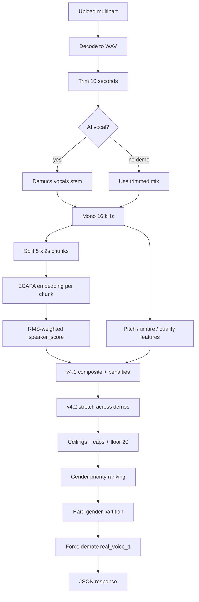

> ⚠️ Устарело (май 2026, Windows-этап проекта). Описывает более раннюю версию
> архитектуры (v4.1/v4.2 scoring, путь c:/Users/_r3drum/...). С тех пор проект
> переехал на Mac, scoring обновился до v5 (добавлен vocal_character), и многие
> пункты из ПЛАН_ДАЛЬШЕ.md уже реализованы. Актуальное состояние смотри в
> памяти Claude / SESSION_NOTES.md, не здесь.

---

# Архитектура Voice Matching (техническая)

Сервис: `voice-matching-service/main.py`  
Эндпоинт: `POST /voice-match`

---

## Обзор пайплайна



---

## 1. Приём и декодирование

**Input (multipart/form-data):**
- `ai_vocal` — один файл
- `demos` — один или несколько файлов (повторяющееся поле)

**Шаги:**
1. Сохранение во временную директорию.
2. Декод в WAV (цепочка fallback):
   - `torchaudio.load` (+ torchcodec + ffmpeg DLL)
   - `soundfile`
   - `pydub` + ffmpeg
   - `librosa`
3. Ошибка → HTTP **400** `{ "error": "...", "step": "loading" }`.

---

## 2. Trim (10 секунд)

Сразу после decode каждый трек обрезается до **первых 10 секунд**. Длинные файлы не попадают в Demucs/ECAPA целиком.

Константа: лог `Audio trimmed to 10 seconds`.

---

## 3. Demucs (только AI vocal)

| | AI vocal | Demo clips |
|---|----------|------------|
| Demucs | Да (`htdemucs`, CPU) | Нет (trimmed mix) |
| Fallback | Trimmed mix при ошибке/таймауте | — |

Параметры MVP: `shifts=0`, `split=False`, сегмент ≤10 s.  
Модель: env `DEMUCS_MODEL` (default `htdemucs`).  
Логи: `Demucs applied` / `Fallback used` / `Skipping Demucs`.

---

## 4. Chunks + ECAPA embeddings

Аудио → mono **16 kHz** → **5 окон по 2 с** (индексы 0–4).

Для каждого чанка с RMS ≥ `CHUNK_MIN_RMS` (0.01):
- SpeechBrain **ECAPA-TDNN** (`spkrec-ecapa-voxceleb`)
- L2-normalize embedding

**speaker_score** (на пару AI↔demo):
- Cosine similarity по **совпадающим индексам** чанков
- Взвешивание по RMS энергии чанка
- Одна пара чанков → discount **0.92**
- Поле ответа: `chunks_used` — число сравненных пар

**Fallback encoder:** MFCC mean-pool + фиксированная проекция 192-dim, если ECAPA недоступен.

---

## 5. Pitch / timbre / quality (v4.1)

На том же 10 s mono 16 kHz (не по чанкам для pitch/timbre):

| Компонент | Вес | Поле | Метод (кратко) |
|-----------|-----|------|----------------|
| Speaker | 34% | `speaker_score` | Chunk ECAPA (выше) |
| Timbre | 28% | `timbre_score` | MFCC cosine, spectral centroid, bandwidth |
| Pitch | 33% | `pitch_score` | Median F0 (yin), semitone distance, range overlap |
| Quality | 5% | `quality_score` | Эвристика качества демо vs AI |

**Raw composite:**

```
similarity_raw = 0.34*speaker + 0.28*timbre + 0.33*pitch + 0.05*quality
```

### Vocal type (multi-feature)

Классификатор `classify_vocal_type_multi_feature`:
- `range_band`: low / mid / high (по median F0)
- `detected_vocal_type`: male | female | unknown
- `high_pitched_male`: dense timbre на высоком pitch → male для ranking

**Штрафы (умножители на composite, до stretch):**
- Range band mismatch: ×0.65 (соседние) или ×0.55 (low vs high)
- Male vs female type: ×0.60
- Rank penalty на mismatch: **−8** баллов

**Alignment bonus:** все три score > 55 → ×1.08

---

## 6. v4.2 нормализация (между демо)

После штрафов на каждом демо — **stretch** по батчу:
- Лучший → ~**85%**, худший → ~**28%**, минимальный span **25** пунктов
- При малом разбросе — rank_boost по позициям (+12 / 0 / −5 / −8 / −10)
- **Глобальный пол** `similarity ≥ 20` — в самом конце

**Потолки по vocal mismatch:** 75% / 82% при слабом pitch overlap.

**Hard caps similarity:** default 88; до 95/99 при идеальном align (никогда 100).

---

## 7. Gender partition и ranking

### Gender-priority (`_apply_gender_priority_ranking`)

Сортировка по **`final_ranking_score`** (не по отображаемому `similarity`):

```
final_ranking_score = similarity
  − (vocal_type_distance × 20)
  − gender_mismatch_penalty
  − tier_penalty
```

Штрафы: 40 (female AI vs male demo pitch), 35 (male↔female), 50 (tier 2).

`final_vocal_type` = manual override ?? detected (+ prototype rules).

### Hard partition (`_apply_hard_gender_partition_ranking`)

Если AI **female** и есть female demo → порядок **female → unknown → male**; male не может быть #0.  
Симметрично для male AI.

Флаги: `hard_gender_block_applied`, `hard_gender_rule_active`.

### Male prototype (`real_voice_1.wav`)

1. Загрузка waveform эталона раз за запрос.
2. Cosine ≥ 0.75 → reclassify as male, `high_pitched_male=true` (если не сам файл).
3. `MANUAL_DEMO_GENDER["real_voice_1.wav"] = "male"`.

### Force demote

`real_voice_1.wav` всегда в **конец** списка, `force_demoted_real_voice_1=true`.

---

## 8. Формат ответа API

### Успех (полный)

JSON **массив** объектов (лучший матч первый по `final_ranking_score` после всех правил):

```json
{
  "filename": "demo.wav",
  "similarity": 72.4,
  "chunks_used": 5,
  "speaker_score": 68.0,
  "timbre_score": 71.2,
  "pitch_score": 65.0,
  "quality_score": 80.0,
  "reasons": ["similar timbre", "similar pitch range"],
  "explanation": "This vocalist matches well in ...",
  "detected_vocal_type": "female",
  "classification_confidence": 0.82,
  "manual_gender": null,
  "final_vocal_type": "female",
  "pitch_avg": 64.2,
  "high_pitched_male": false,
  "similarity_to_real_voice_1": false,
  "ai_detected_vocal_type": "female",
  "vocal_type_match": true,
  "final_ranking_score": 68.1,
  "gender_priority_tier": 0,
  "hard_gender_block_applied": false,
  "force_demoted_real_voice_1": false
}
```

### Partial (таймаут)

```json
{
  "results": [ /* те же объекты */ ],
  "partial": true
}
```

### Ошибки

| HTTP | Причина |
|------|---------|
| 400 | Невалидное аудио |
| 422 | Нет ai_vocal / demos |
| 500 | Неожиданная ошибка |

---

## 9. Производительность и деградация

| Лимит | Значение |
|-------|----------|
| Аудио | 10 s анализа |
| Запрос | 30 s (`REQUEST_TIMEOUT_SEC`) |
| CPU | Demucs + ECAPA + librosa на CPU |

При нехватке времени: пропуск Demucs, пропуск необработанных демо, `partial: true`.

---

## 10. Интеграция с Next.js

`lib/admin-ai-voice-matching.ts`:
- POST `${VOICE_MATCH_API_URL}/voice-match`
- Парсит array или `{ results, partial }`
- Маппит snake_case → camelCase
- Строит `matchPercent` из `final_ranking_score` (инвертированный min–max для UI)
- Русские `displayVocalType`, feature tags, comparison sections

Клиент **не** пересчитывает vocal type с pitch-only — доверяет API `final_vocal_type`.

---

## 11. Отладка

```bash
cd voice-matching-service
python -c "from main import _sanity_check_scoring_calibration; _sanity_check_scoring_calibration()"
```

```powershell
$env:VOICE_MATCH_SCORING_SANITY="1"
python main.py
```

`scripts/verify-endpoints.py` — smoke HTTP тесты.

---

*См. также `voice-matching-service/README.md` — полный список констант и таблиц scoring.*
